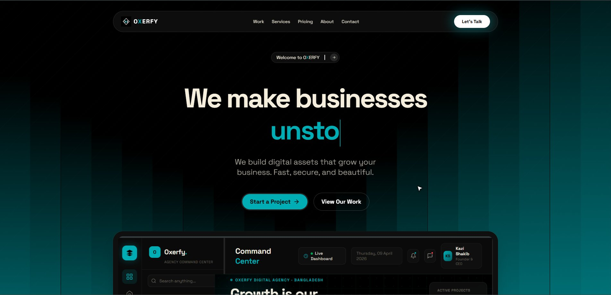
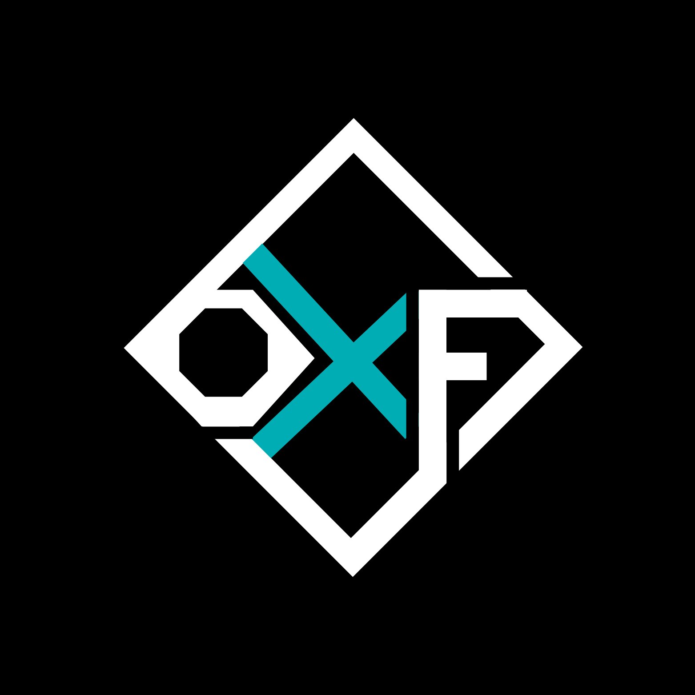
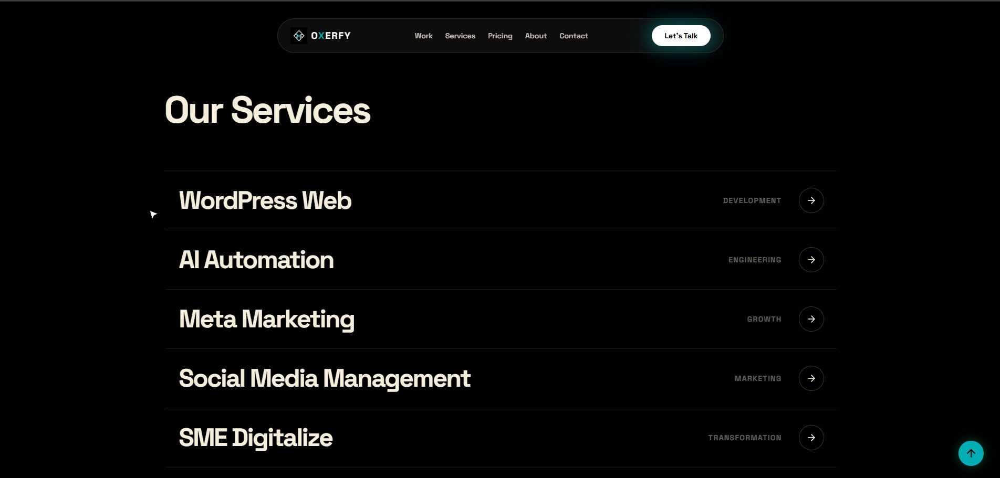
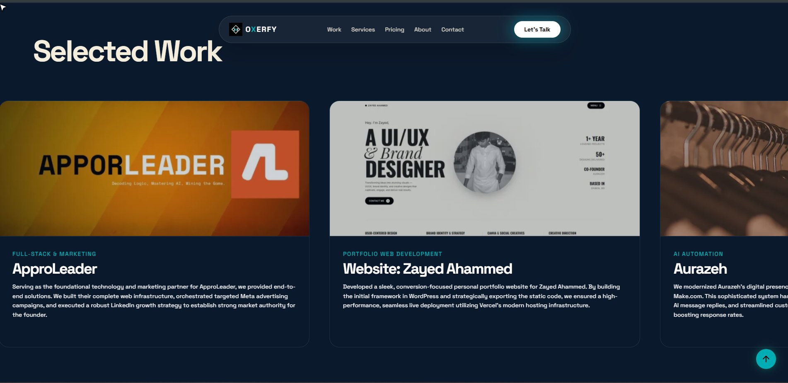
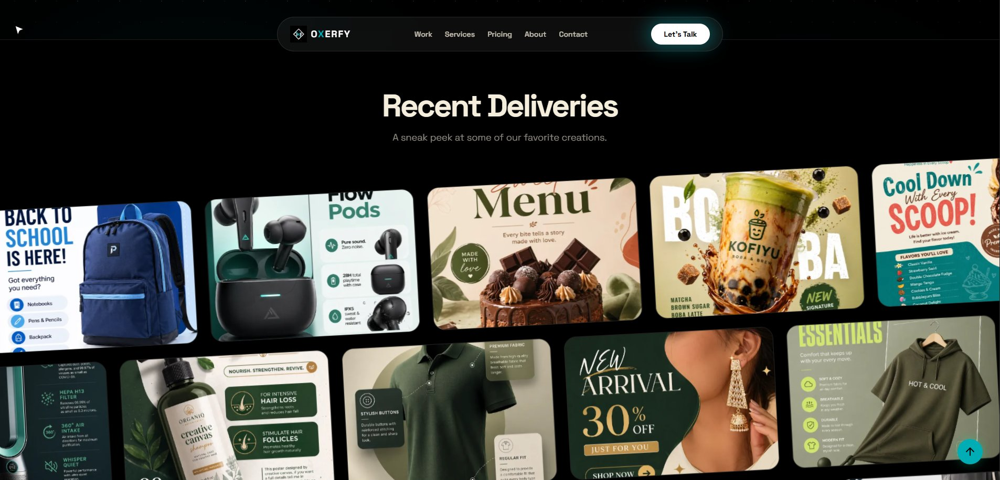
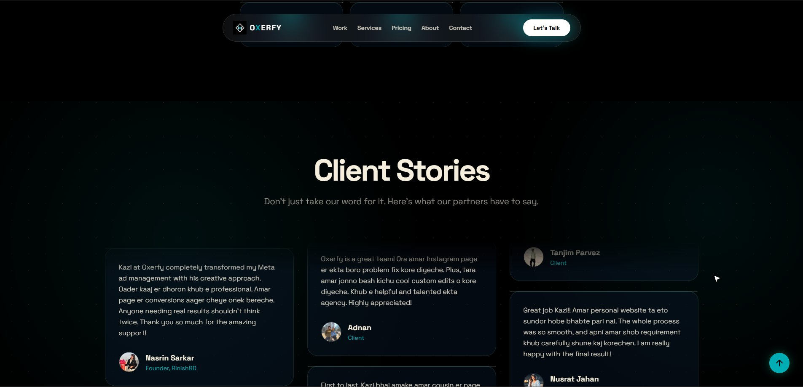
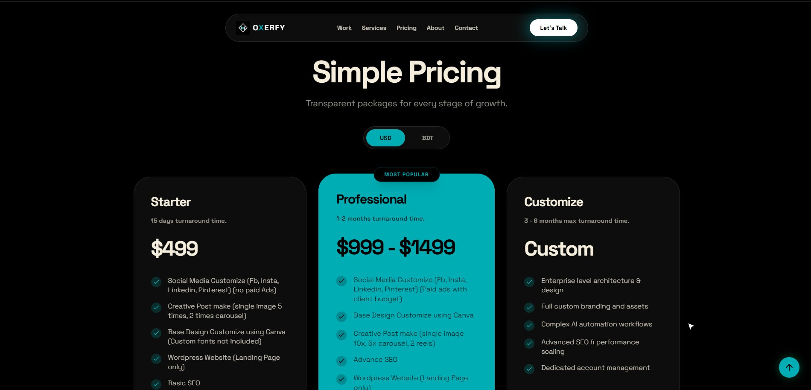

<div align="center">



<br/>
<br/>



# ◈ OXERFY

### *Your Growth. Our Mission.*

**A high-performance digital agency website built with React, Firebase & Vite — fully CMS-powered, real-time, and production-hardened.**

<br/>

[](https://oxerfy.vercel.app)
[](https://react.dev)
[](https://firebase.google.com)
[](https://www.typescriptlang.org)
[](https://vercel.com)
[](https://tailwindcss.com)

</div>

---
## ▶️ Demo Video

https://github.com/user-attachments/assets/75d52ef4-e84f-47a5-8991-5739a877f7bd
---
## ✦ Screenshots

<table>
  <tr>
    <td width="50%">
      
      <p align="center"><b>Our Services</b></p>
    </td>
    <td width="50%">
      
      <p align="center"><b>Selected Work</b></p>
    </td>
  </tr>
  <tr>
    <td width="50%">
      
      <p align="center"><b>Recent Deliveries Gallery</b></p>
    </td>
    <td width="50%">
      
      <p align="center"><b>Client Stories</b></p>
    </td>
  </tr>
  <tr>
    <td colspan="2">
      
      <p align="center"><b>Simple Pricing — USD & BDT</b></p>
    </td>
  </tr>
</table>

---

## ✦ About

**Oxerfy** is a Dhaka-based digital agency that builds fast, beautiful, and scalable digital assets — from WordPress websites and Meta ad campaigns to AI automation systems. This is the **official agency website**, built entirely with modern web technologies and a fully real-time CMS backend.

Every section — projects, testimonials, services, pricing, FAQ, and images — is editable through a **secure admin panel** with instant live updates. No rebuilds. No redeploys. Just click and it's live.

---

## ✦ Tech Stack

| Layer | Technology |
|---|---|
| **Frontend** | React 19 + TypeScript |
| **Build Tool** | Vite |
| **Styling** | Tailwind CSS v4 |
| **Animation** | Framer Motion + GSAP |
| **3D Effects** | Three.js + React Three Fiber |
| **Database** | Firebase Firestore (real-time) |
| **Auth** | Firebase Authentication (Google OAuth) |
| **Email** | Web3Forms API |
| **SEO** | React Helmet Async |
| **Hosting** | Vercel |

---

## ✦ Features

### 🌐 Public Website
| Feature | Description |
|---|---|
| **Animated Hero** | Typewriter effect with custom cursor and ambient background |
| **Services Section** | Real-time from Firestore — editable via admin |
| **Selected Work** | Portfolio cards with project details and live links |
| **Recent Deliveries** | Infinite scrolling image gallery marquee |
| **Client Stories** | Masonry-layout testimonials from real clients |
| **Simple Pricing** | USD & BDT toggle — 3 packages, live editable |
| **FAQ Accordion** | Expandable questions, real-time from database |
| **Contact Form** | Saves to Firestore + sends email via Web3Forms |
| **CountUp Stats** | Animated impact metrics |
| **Custom Cursor** | Animated cursor that reacts to hover states |

### 🔐 Admin Panel (`/admin`)
| Feature | Description |
|---|---|
| **Google Auth** | Only authorized emails can access |
| **Projects Manager** | Add / Edit / Delete portfolio projects with images |
| **Testimonials Manager** | Full CRUD for client reviews |
| **Services Manager** | Edit services with color accents and ordering |
| **Pricing Manager** | Manage all 3 pricing packages + feature lists |
| **FAQ Manager** | Add, reorder, and delete FAQ items |
| **Gallery Manager** | Upload and manage infinite-scroll gallery images |
| **Site Assets** | Replace founder photo, hero image, and more |
| **Settings** | Update LinkedIn, WhatsApp, phone, email globally |
| **Submissions Viewer** | Read and manage all contact form messages |

### 🛡️ Security
| Protection | Implementation |
|---|---|
| **No hardcoded secrets** | All keys in environment variables only |
| **Login rate limiting** | 5 attempts / 15 min → 30 min block |
| **Contact form protection** | 3 submissions / hour per browser |
| **File validation** | MIME type allowlist + 5 MB size cap |
| **Input sanitization** | All fields sanitized before Firestore writes |
| **Firestore rules** | Server-side field validation + deny-all fallback |
| **Security headers** | HSTS, CSP, X-Frame-Options, nosniff, and more |

---

## ✦ Getting Started

### 1. Clone the repository
```bash
git clone https://github.com/thekazishakib/Oxerfy.git
cd Oxerfy
```

### 2. Install dependencies
```bash
npm install --legacy-peer-deps
```

### 3. Configure environment variables
```bash
cp .env.example .env
```

Fill in your values in `.env` — refer to `.env.example` for all required keys.

### 4. Deploy Firestore security rules
```bash
npm install -g firebase-tools
firebase login
firebase deploy --only firestore:rules
```

### 5. Run locally
```bash
npm run dev
```

### 6. Build for production
```bash
npm run build
```

---

## ✦ Deployment

Hosted on **Vercel**. Steps to deploy:

1. Push your code to GitHub
2. Go to [vercel.com](https://vercel.com) → **New Project** → Import your repository
3. Set **Framework Preset** to `Vite`
4. Add all environment variables from `.env.example` under **Vercel Dashboard → Project → Settings → Environment Variables**
5. Add your Vercel domain under **Firebase Console → Authentication → Authorized Domains**
6. Click **Deploy** 🚀

> The `vercel.json` file is already configured with SPA routing and full security headers — no extra setup needed.

---

## ✦ Project Structure

```
Oxerfy/
├── src/
│   ├── components/         # Reusable UI components
│   │   ├── ui/             # Base UI elements (Button, Navbar, Skeleton…)
│   │   └── blocks/         # Larger section blocks (Hero, etc.)
│   ├── lib/
│   │   ├── firebase.ts     # Firebase init (env-var only)
│   │   └── security.ts     # RateLimiter, validators, sanitizers
│   ├── pages/
│   │   ├── Landing.tsx     # Public homepage
│   │   └── Admin.tsx       # Secure admin panel
│   └── App.tsx             # Root component & routing
├── docs/screenshots/       # README screenshots
├── firestore.rules         # Server-side security rules
├── vercel.json             # Routing + security headers
└── .env.example            # Environment variable template
```

---

## ✦ Environment Variables

| Variable | Description | Required |
|---|---|---|
| `VITE_FIREBASE_API_KEY` | Firebase Web API Key | ✅ |
| `VITE_FIREBASE_AUTH_DOMAIN` | Firebase Auth Domain | ✅ |
| `VITE_FIREBASE_PROJECT_ID` | Firestore Project ID | ✅ |
| `VITE_FIREBASE_STORAGE_BUCKET` | Storage Bucket | ✅ |
| `VITE_FIREBASE_MESSAGING_SENDER_ID` | Messaging Sender ID | ✅ |
| `VITE_FIREBASE_APP_ID` | App ID | ✅ |
| `VITE_WEB3FORMS_KEY` | Web3Forms public key | ✅ |
| `VITE_APP_URL` | Canonical site URL | ✅ |
| `VITE_FIREBASE_MEASUREMENT_ID` | Analytics (optional) | ❌ |

> ⚠️ Never commit `.env` — it is gitignored. Add real values in Vercel's Environment Variables panel.

---

## ✦ Development Notes

This project was developed by **Kazi Shakib** with assistance from **Google AI Studio** and **Claude (Anthropic)** — used for code generation, debugging, security hardening, and deployment guidance.

All architectural decisions, content, design direction, and final implementation were led and managed by **Kazi Shakib**.

---

## ✦ Author

**Kazi Shakib**

[](https://kazishakib.vercel.app)
[](https://github.com/thekazishakib)
[](https://linkedin.com/in/kazishakib)
[](https://instagram.com/thekazishakib)

---

<div align="center">

**Built with ❤️ in Bangladesh 🇧🇩**

© 2026 Kazi Shakib. All rights reserved.

</div>
